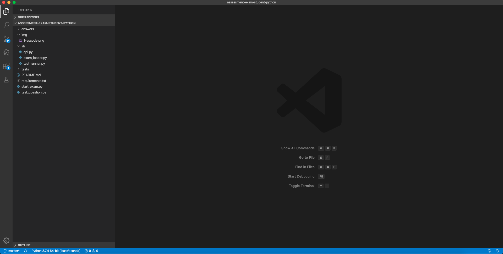

# Assessment Test Runner

This repository is how you will take your assessment test. From this repo, you will start your test, write your solutions, and submit your answers using the command line. Please take the time to carefully follow each step.

Due to the inclusion of embedded screenshots, we suggest you read this file in HTML format, here:

<https://github.com/lighthouse-labs/assessment-exam-student-python>

## Getting Started

Please carefully follow the instructions below to get started.

**Important Note:** If you make a mistake in performing these steps (and see unexpected behavior), you will need to RESTART from step 1 (clone the repo)!

---

> 1. Clone the repository

To start, **CLONE** (do not _fork_) this repo to your local Vagrant machine, and `cd` into the folder:

```terminal
git clone https://github.com/lighthouse-labs/assessment-exam-student-python.git
cd assessment-exam-student-python
```

> 2. Install Required Packages

Run the following command from within the project directory:

```terminal
pip install -r requirements.txt
```

---

> 3. Open the entire project in Visual Studio Code

Open the entire project directory in VS Code. You should see the directory tree on the left-hand side:



---

> 4. Start the test from a terminal window

Enter the command below to start the test:

- Once you start the exam, the test timer will start.

```terminal
python start_exam.py -t <EXAM_TOKEN>
```

> Replace `<EXAM_TOKEN>` with the token provided to you on Compass.

This command downloads the test questions to your local file system. You should see new files in the `answers/` directory.

You should see output that looks like this (note: output may vary based on which test you are taking):

```
Contacting Server to Start Exam "data-01"

Server Response: 5 Questions:
  Creating Question 00  (30 Points) Answer file: answers/question_00.py
  Creating Question 01  (30 Points) Answer file: answers/question_01.py
  Creating Question 02  (20 Points) Answer file: answers/question_02.py
  Creating Question 03  (20 Points) Answer file: answers/question_03.py
  Creating Question 04  (20 Points) Answer file: answers/question_04.py
```

If you see an error, please let the proctor know. **You may need to re-clone and restart the process from step 1 if the problem persists!**

---

## Answering Questions

Now you're ready to start answering questions! Follow these steps carefully:

> 1. Expand the `answers/` directory in your code editor.

Note that the question numbering starts at `0`.

---

> 2. Execute the test code

From the command line, execute the automated tests for the first question, question 0, using the command below (question numbering starts at 0):

```terminal
python test_question.py -q [<QUESTION_NUMBER>]
```

---

> 3. Read the output carefully

Notice that none of the tests for question 0 are passing.

---

> 4. Write some code

Implement the code to make the first test pass, located in `answers/question_00.py`.

Run the `python test_question.py -q 0` command again to make sure you are starting to see solutions.

Notice that your score for the question also went up. The number of automated tests passing the primary factor for how your score is calculated.

It is recommended that you run the `python test_question.py -q [<QUESTION_NUMBER>]` command frequently.

---

> 5. Repeat for all questions

Once you complete `python test_question.py -q 0`, repeat these steps but this time with `python test_question.py -q 1` (the code for which should is in `answers/question_01.py`).

## Submission Grading

- You can submit questions multiple times during your development process
- Points are awarded based on how your solutions perform during the evaluation
- Submissions will still be accepted after the end of the test period
